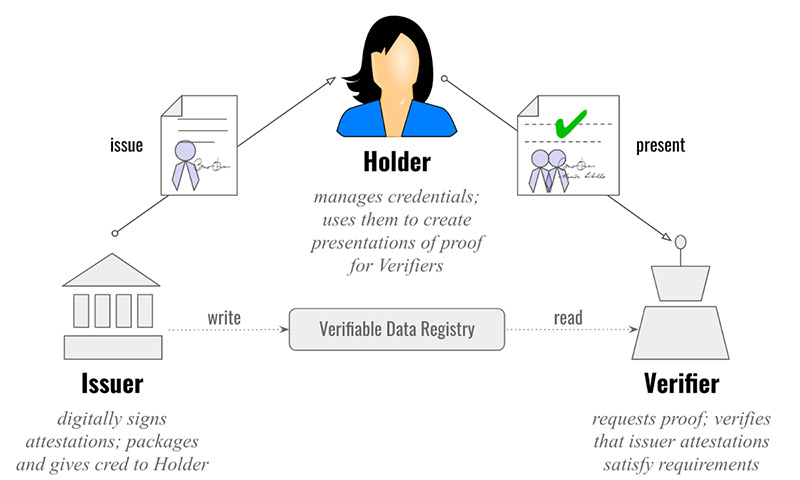

## Introduction

Self Sovereign Identity is a lifetime portable identity for any person, organization, or thing that does not depend on any centralized authority and can never be taken away. Self-sovereign identity is a two-party relationship model, with no third party coming between you and the organization, now considered your “peer”.

SSI is possible today with DIDs and Verifiable Credentials.

### Decentralized Identifier - DID
DID is a new type of globally unique identifier (URI) that does not require a centralized registration authority because control of the identifier can be proved using cryptography. You can think of it like one of the identifiers we’re more familiar with—a domain name or a phone number—without a central registrar like ICANN or NANP.

### Verifiable Credentials
Verifiable Credential (VC) is the new format for interoperable digital credential being defined by the W3C Verifiable Claims Working Group. Verifiable credentials conform to the [W3C’s Verifiable Credentials Data Model](https://www.w3.org/TR/vc-data-model/), and they facilitate interactions using a pattern called the triangle of trust:

Issuers create credentials, usually by having JSON docs [digitally signed](https://en.wikipedia.org/wiki/Digital_signature) in a special way. Holders store them, and verifiers ask for proof based upon them. Verifiable presentations that Holders provide to Verifiers are packages of evidence—either credentials, or data derived from one or more credentials—built by holders to satisfy a verifier’s requirements. Verifiers learn with certainty which issuers have attested something by checking digital signatures against a verifiable data registry (typically, a blockchain).

Digitally signed verifiable credentials can cryptographically prove four things to any verifier:
1. Who (or what) is the issuer
2. To whom (or what) it was issued
3. Whether it has been altered since it was issued
4. Whether it has been revoked by the issuer

## Verity
Verity is built as an [Aries compatible](https://www.hyperledger.org/projects/aries) enterprise agent capable of running protocols for connecting, issuing Verifiable Credentials and requesting and Zero Knowledge Proofs to and from individuals. Verity is primarily intended for organizations that want play either the role of the Issuer or the Verifier or both. 
	
Verity also incorporates a digital wallet for storing keys, it orchestrates all communication to Sovrin/Indy ledger and rest of the Sovrin/Indy ecosystem by running protocols with other Aries compatible agents, whether those are controlled by individuals, running on their mobile devices or controlled by organizations running on a server or in cloud. Verity performs all necessary cryptographic operations like encrypting, decrypting, digital signing, etc hiding away all the complexity from its users. 
	
Verity is currently hosted and managed by Evernym, while you are responsible for building the integration layer with Verity. This repo also provides local version of Verity in a Docker, but this is only intended for development and learning purposes. 

### Getting started with Verity
The best way to start with Verity is to go through the example app that will walk you through the installation of Verity SDK and through the main capabilities of the Verity. Communication with Verity is asynchronous and requires you to stand up an endpoint where Verity will send its response. The example app and other sample code uses ngrok as a temporary service to provide such an endpoint but for building your own code to use for pilot or production, we recommend standing up your own endpoint.

### Verity SDK
The goal of the Verity SDK is to provide easy application integration with the Verity server. With Verity SDK, you can enable issuing or verifying or both functions into your project and interact with individuals using Connect.Me or some other compatible digital wallet app. Verity SDK also provides methods for writing Schemas and Credential Definitions to the ledger.

The SDK uses libindy and DIDcomm protocols to securely authenticate and communicate with the Verity server. With the creation of language-specific bindings, developers can quickly integrate their backend services into the world of SSI with minimal overhead.

By design, Verity SDK is largely stateless (requiring only a small configuration context and a single public/private key pair), which allows applications to orchestrate SSI integrations without heavy involvement in the interactions.

#### Terminology
The instructions for this SDK use the following terms:
- Verity Application Service -- Evenym's Verity platform hosted and managed by Evernym and provided as SaaS
- Example application -- A sample application in the 'Getting Started' guided tutorial  intended to demonstrate the main functionalities of Verity and to walk you through setting up and using Verity SDK

#### Minimum system requirements

Minimum system requirements of Verity SDK match system requirements for a language runtime. Enough is defined by an app and a flow, as some apps may try to force Indy SDK to keep an unlimited amount of data in RAM.

Languages: Python 3.6, Java 11 (OpenJDK), NodeJS 12, and .NET Core SDK 3.1.

#### First steps
These are the general steps for getting going with the Verity SDK:
1. Provisioning an Agent on Evernym's Verity Application Serivce
2. Integrate the language-specific Verity SDK library.
3. Optional -- Walk-through the 'Getting Started' guided tutorial.

##### 1. Provisioning an Agent on Evernym's Verity Application
Verity SDK requires access to an agent running on Evernym's Verity Application. Contact Evernym to get a provisioning token that you'll need to provision an Agent on Verity Application Service.

Provisioning token for Sandbox plan is valid for the Sovrin Staging Net. Token can only be used once and it expires after 30 days. If you require additional token, please contact Evernym support. 

##### 2. Integrate the language-specific Verity SDK library
The Verity SDK comes is several language-specific libraries. See the respective README documents to get the latest version, read the API documentation and other information:

* [Java](sdk/java-sdk/README.md)
* [NodeJs](sdk/nodejs-sdk/README.md)
* [Python](sdk/python-sdk/README.md)
* [.NET](sdk/dotnet-sdk/README.md)

##### 3. Optional -- Walk-through the 'Getting Started' guided tutorial
The 'Getting Started' guide is a guided tutorial that walks-through a couple of simple SSI use-cases using Verity and the Verity SDK. The guide can be done with Docker to simplify setting up an environment or can be done using a local developer environment.

See the [Getting Started](docs/getting-started/getting-started.md) guide documentation.

### REST API
Besides Verity SDK, you can also use the REST API to integrate with Verity. Verity REST API requires you to have DomainDID and APIkey in other to authenticate. DomainDID and APIkey are provided by Evernym, but you can also create those yourself by calling the restApiToken on the Verity Context object which is created by provisioning an Agent with the SDK. 

See the Open API specification for the Verity REST API at https://app.swaggerhub.com/apis/evernym/verity-rest-api/1.0

### Firewall Rules

Using the Verity SDK or REST API requires the following rules in your firewall:

| Direction | Protocol | Port           | MIME Type                |
| --------- | -------- | -------------- | -------------------------|
| Outbound  | HTTP     | 80             | application/octet-stream |
| Outbound  | HTTPS    | 443            | application/octet-stream |
| Inbound   | HTTP     | [user-defined] | application/octet-stream |
| Inbound   | HTTPS    | [user-defined] | application/octet-stream |

### Sample Code
Here you can find links to various sample codes and example apps that cover different use cases, from generic issuing or verifying to the user registration and user login using SSI auth.  Most of the apps can be run either natively or in a Docker. 

#### Sample code for SDK:
- [Example app for Java SDK](samples/sdk/java-example-app)
- [Example app for NodeJs SDK](samples/sdk/nodejs-example-app)
- [Example app for Python SDK](samples/sdk/python-example-app)
- [Example app for .NET SDK](samples/sdk/dotnet-example-app)
- [Sample web app for out of band protocol with request attach - scanning a QR code to start issuing or proof presentation protocol](samples/sdk/oob-with-request-attach) 

#### Sample code for REST API:
- [Sample Issuer app](samples/rest-api/issuer)
- [Sample Verifier app](samples/rest-api/verifier)
- [Generic web app that allows you to perform most of the Verity's functions like Creating Schemas, Cred Defs, Issuing and Verifying](samples/rest-api/web-app)
- [Sample app for identifying returning user - authentication use case](samples/rest-api/out-of-band)
- [Sample web app for ssi auth - 2FA use case and user registration and authentication use case](samples/rest-api/ssi-auth)

### Tutorials
Various tutorials and instructions can be found [here](docs/howto).

### Architectiure
More information about the architecture of Evernym platform and sequence diagrams for basic protocols such are connecting, issuing and proving, you can find [here](docs/verity-architecture).

### Data retention
More information about the data retention on Verity, the default configuration and how default can be changed can be found [here](docs/DataRetention.md).

### Improving documentation

Can’t find what you are looking for, or have suggestions on what to include in the docs? [Drop us a line](mailto:support@evernym.com), we'd love to receive your ideas.

## Acknowledgements
This effort is part of a project that has received funding from the European Union’s Horizon 2020 research and innovation program under grant agreement No 871932 delivered through our participation in the eSSIF-Lab, which aims to advance the broad adoption of self-sovereign identity for the benefit of all.

---
For more information about Evernym products, visit https://www.evernym.com/products/.
