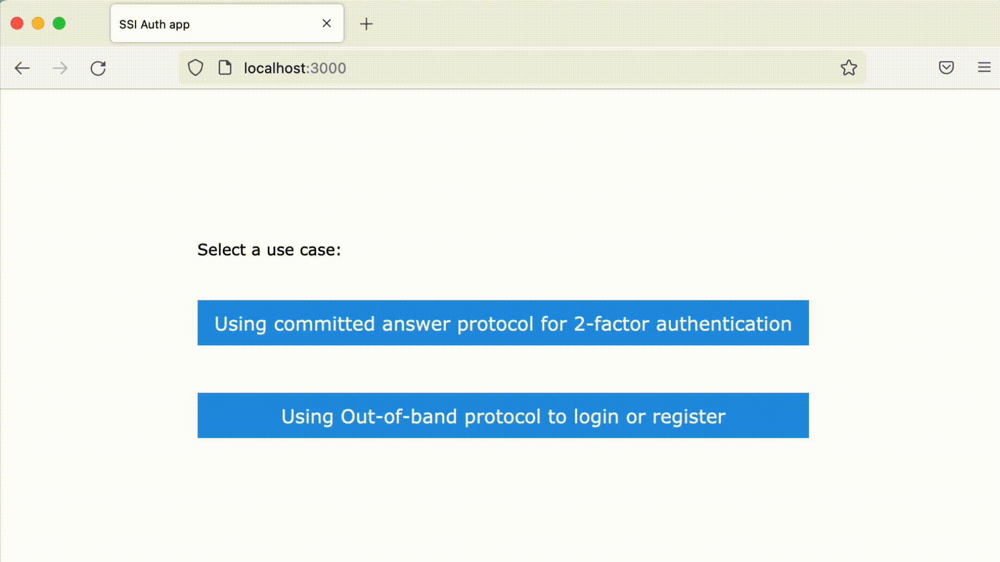
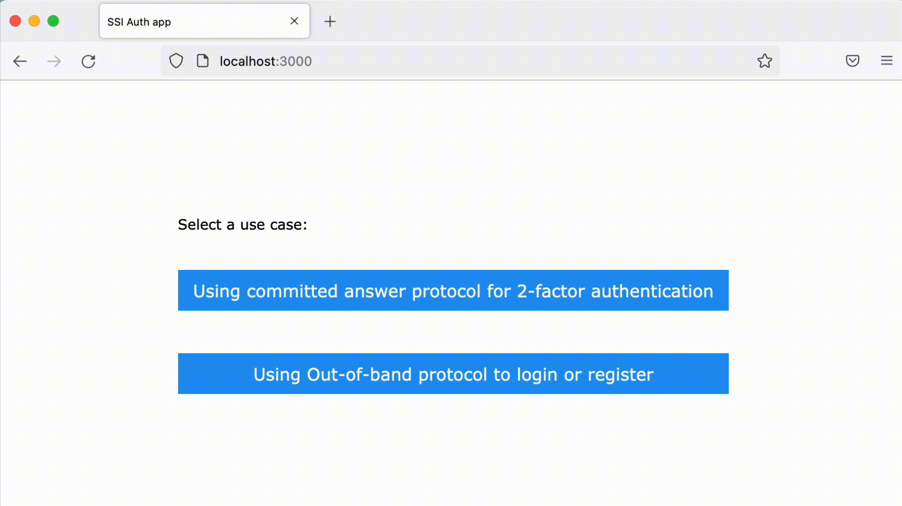

## Verity SSI Authentication Demo Web App Tutorial

This tutorial will walk you through the SSI Authentication Demo Web App and demonstrate how SSI can be used to add authentication capabilities to your application. 

Two use cases will be covered: 
- [using Committed answer protocol as a form of two-factor authentication](#using-committed-answer-protocol-as-a-form-of-two-factor-authentication)
- [using Out-of-band protocol to register or login by scanning a QR code](#using-out-of-band-protocol-to-register-or-login-by-scanning-a-qr-code)

The interaction will happen between a user, Alice, and a Service Provider – the SSI Savvy Org. 

### Using Committed Answer Protocol as a form of two-factor authentication

There are multiple use cases where one party will need to answer a question asked by another party. For example, think about authorizing transactions, proving identity, giving consent, or validating logins (2FA). 

In this first scenario, Alice will register an account with the SSI Savvy Org. After becoming a registered user, she will respond to a multiple-choice question to confirm she is the rightful owner of her account. Thus, [CommittedAnswer protocol](https://app.swaggerhub.com/apis/evernym/verity-rest-api/1.0#/CommittedAnswer) will be used to add an extra authentication step as the user logs in to her account.

In order to use the Committed Answer Protocol, questioner and responder have to first establish a connection and exchange pairwise keys. These pairwise keys can be used to encrypt and verify the response. Every response the responder sends back can be cryptographically signed using that same key that belongs to that responder's DID, so the questioner will know with a very high degree of confidence that the answer was sent by the responder. 

#### STEP 1 – Creating a Relationship and Sending a QR-code Invitation



Alice first registers an account by setting up a username, email, and password. Upon new user's registration, SSI Savvy Org creates a new relationship via [Relationship Protocol](https://app.swaggerhub.com/apis/evernym/verity-rest-api/1.0#/Relationship). As part of a Relationship Protocol, an invitation is sent in a form of a QR code. Note that `RelationshipInvite` contains `inviteURL` communicated in out of band manner. 

Implementation example:

```javascript
async function createInvitation () {
  const relationshipCreateMessage = {}
  const relThreadId = uuid4()
  const relationshipCreate =
   new Promise(function (resolve, reject) {
     relCreateResolveMap.set(relThreadId, resolve)
     sendVerityRESTMessage('123456789abcdefghi1234', 'relationship', '1.0', 'create', relationshipCreateMessage, relThreadId)
   })
  const relationshipDid = await relationshipCreate

  // create relationship invitation using the Out-of-Band protocol
  const relationshipInvitationMessage = {
    '~for_relationship': relationshipDid
  }
  const relationshipInvitation =
   new Promise(function (resolve, reject) {
     relInvitationResolveMap.set(relThreadId, resolve)
     sendVerityRESTMessage('123456789abcdefghi1234', 'relationship', '1.0', 'out-of-band-invitation', relationshipInvitationMessage, relThreadId)
   })
  const [inviteUrl, invitationId] = await relationshipInvitation
  inviteToDidMap.set(invitationId, relationshipDid)

  return [relationshipDid, inviteUrl]
}
```
`relationshipDid` is a pairwise pseudonymous DID assigned by the SSI Savvy Org to Savvy Org:Alice relationship. 
`inviteUrl` will be converted into a QR code that will be displayed to a user.    

We then wait for Alice to initiate the Connection protocol and accept the connection. Once Alice scans the QR code and accepts the invitation using Connect.Me, SSI Savvy Org will send `ConnRequestReceived` (`did:sov:BzCbsNYhMrjHiqZDTUASHg;spec/connections/1.0/request-received`) and `ConnResponseSent` (`did:sov:BzCbsNYhMrjHiqZDTUASHg;spec/connections/1.0/response-sent`) callbacks to the webhook. 

Observe messages arriving to the webhook. 

Message with `"@type": "did:sov:BzCbsNYhMrjHiqZDTUASHg;spec/connections/1.0/request-received"` means that Alice has scanned the QR code containing the invitation from the SSI Savvy Org.

Message with `"@type": "did:sov:BzCbsNYhMrjHiqZDTUASHg;spec/connections/1.0/response-sent"` completes the connection meaning that the SSI Savvy Org and Alice have established a secure and encrypted communication channel.

```json
{
    "conn": {
        "DID": "RDJVv8uU1KrNDKMTti3sjY",
        "DIDDoc": {
            "id": "RDJVv8uU1KrNDKMTti3sjY",
            "publicKey": [
                {
                    "id": "RDJVv8uU1KrNDKMTti3sjY#1",
                    "type": "Ed25519VerificationKey2018",
                    "controller": "RDJVv8uU1KrNDKMTti3sjY",
                    "publicKeyBase58": "ECPkDdVyEAdo64zS2pXwKxvvGsq9xVPi2wzcinAMN2LP"
                }
            ],
            "service": [
                {
                    "id": "did:example:123456789abcdefghi;indy",
                    "type": "IndyAgent",
                    "recipientKeys": [
                        "ECPkDdVyEAdo64zS2pXwKxvvGsq9xVPi2wzcinAMN2LP"
                    ],
                    "routingKeys": [
                        "BHMCrtNjgsbGo936cHKwntG2oVhQCcpqqVxxAqaxwEg9",
                        "2WXxo6y1FJvXWgZnoYUP5BJej2mceFrqBDNPE3p6HDPf"
                    ],
                    "serviceEndpoint": "https://agency.pps.evernym.com/agency/msg"
                }
            ],
            "@context": "https://w3id.org/did/v1"
        }
    },
    "myDID": "RRYjdx1WShEfhggfQHZwP1", 
    "@type": "did:sov:BzCbsNYhMrjHiqZDTUASHg;spec/connections/1.0/request-received",
    "@id": "26b49deb-8f98-46c1-aec2-a6cb4258eac1",
    "~thread": {
        "thid": "368d435d-07e6-4b07-a051-7f2bea8faa10"
    }
}

{
    "resp": {
        "connection~sig": {
            "signature": "AvLFA6ZAUQiQiPa4LmqPOyvtJi7NcI5ExQd2GGYnOmbuaOR11nZ0HZouaz9VF1SHoBIvcdhDekt-2NmANqaJAg==",
            "sig_data": "AAAAAGExuvF7IkRJRCI6IjRaWVFmbXNDaTllWWNYTkg1TFFFakQiLCJESUREb2MiOnsiaWQiOiI0WllRZm1zQ2k5ZVljWE5INUxRRWpEIiwicHVibGljS2V5IjpbeyJpZCI6IjRaWVFmbXNDaTllWWNYTkg1TFFFakQja2V5cy0xIiwidHlwZSI6IkVkMjU1MTlWZXJpZmljYXRpb25LZXkyMDE4IiwiY29udHJvbGxlciI6IjRaWVFmbXNDaTllWWNYTkg1TFFFakQiLCJwdWJsaWNLZXlCYXNlNTgiOiIyd2FCaHV1VkxyeGlvMW13dHU3aDhHNG9Ma1RZbmdSOGpTalN4NlVwRzR1WSJ9XSwic2VydmljZSI6W3siaWQiOiI0WllRZm1zQ2k5ZVljWE5INUxRRWpEO2luZHkiLCJ0eXBlIjoiSW5keUFnZW50IiwicmVjaXBpZW50S2V5cyI6WyIyd2FCaHV1VkxyeGlvMW13dHU3aDhHNG9Ma1RZbmdSOGpTalN4NlVwRzR1WSJdLCJyb3V0aW5nS2V5cyI6WyJFeFBGTHg0dU5qRjlqUlFKVjdYeEF0OE1mdVhKRU5nYmdBMXFObVd6bnNSWiJdLCJzZXJ2aWNlRW5kcG9pbnQiOiJodHRwczovL3Zhcy5wcHMuZXZlcm55bS5jb20vYWdlbmN5L21zZyJ9XSwiQGNvbnRleHQiOiJodHRwczovL3czaWQub3JnL2RpZC92MSJ9fQ==",
            "signer": "2waBhuuVLrxio1mwtu7h8G4oLkTYngR8jSjSx6UpG4uY",
            "@type": "did:sov:BzCbsNYhMrjHiqZDTUASHg;spec/signature/1.0/ed25519Sha512_single"
        }
    },
    "myDID": "RRYjdx1WShEfhggfQHZwP1",
    "@type": "did:sov:BzCbsNYhMrjHiqZDTUASHg;spec/connections/1.0/response-sent",
    "@id": "25891bd0-dff8-4a12-8bba-1fca22ecf961",
    "~thread": {
        "thid": "368d435d-07e6-4b07-a051-7f2bea8faa10",
        "sender_order": 0
    }
}
```

`"myDID": "RRYjdx1WShEfhggfQHZwP1"` is a pairwise pseudonymous DID assigned by the SSI Savvy Org to SSI Savvy Org:Alice relationship.

`"DID": "RDJVv8uU1KrNDKMTti3sjY"` is a pairwise pseudonymous DID Alice created specifically for her relationship with the SSI Savvy Org. 

This exchange of unique pairwise DIDs between a user and a service provider creates a private and secure communications channel between the two parties that will be used for all further communications. 

> **NOTE:**
>
> Once formed, DID-to-DID connections can be used for any type of secure communications between the parties. There are no intermediary service providers of any kind involved. These connections are capable of lasting forever, and will only be broken if one or both parties choose so. 
>

After scanning the QR code and accepting the connection in Connect.Me, Alice will be redirected to her Account Page. 

Note *Your Pairwise Connection DID* displayed to Alice on her Account Page: *RRYjdx1WShEfhggfQHZwP1*. 

Alice will then log out and log in to her account. 

#### STEP 2 – Asking a Question: the Committed Answer Protocol 



Using an already established pairwise connection and agent-to-agent communication, the SSI Savvy Org will send a multiple-choice question to Alice. Alice will receive a notification about the question in her Connect.Me wallet and choose the correct option. After selecting the correct response on her mobile device, Alice will be redirected to her Account Page. 

Observe messages arriving to the webhook: 

```json
Posting message to https://vas.pps.evernym.com/api/MQcX5EGR3rq6Vq4TdUmqNB/committedanswer/1.0/0dcfe77e-f7d3-45ca-aaab-598f9b53bee
{
    "~for_relationship": "RRYjdx1WShEfhggfQHZwP1",
    "text": "Select the response",
    "detail": "2FA",
    "valid_responses": [
        1426,
        4020,
        7148,
        7359,
        9755
    ],
    "signature_required": false,
    "@type": "did:sov:BzCbsNYhMrjHiqZDTUASHg;spec/committedanswer/1.0/ask-question",
    "@id": "351c3f66-1ce7-45cd-a76d-727f6fbcbe78"
}
```
After Alice has chosen the correct answer in her wallet:  

```json
{
    "answer": "1758",
    "valid_answer": true,
    "valid_signature": true,
    "not_expired": true,
    "@type": "did:sov:BzCbsNYhMrjHiqZDTUASHg;spec/committedanswer/1.0/answer-given",
    "@id": "5cd7d163-3831-42b5-9068-ead1ba5c887b",
    "~thread": {
        "thid": "0dcfe77e-f7d3-45ca-aaab-598f9b53bee9",
        "sender_order": 0,
        "received_orders": {
            "RDJVv8uU1KrNDKMTti3sjY": 0
        }
    }
}
```
`"~for_relationship": "RRYjdx1WShEfhggfQHZwP1"` is the same pairwise pseudonymous DID assigned by the SSI Savvy Org to SSI Savvy Org:Alice relationship.

Note that `signature_required` is set to `false` in this example. If a signature were required, Alice would use her private pairwise key to sign her response.

Implementation example:

```javascript
// Send 2FA challenge to the pairwise DID registered with the user
const challengeQuestionMessage = {
    '~for_relationship': usersMap.get(user).did,
    text: 'Select the response',
    detail: '2FA',
    valid_responses: answers,
    signature_required: false
}

const questionThreadId = uuid4()
const challengeQuestion =
new Promise(function (resolve, reject) {
    questionResolveMap.set(questionThreadId, resolve)
    sendVerityRESTMessage('BzCbsNYhMrjHiqZDTUASHg', 'committedanswer', '1.0', 'ask-question', challengeQuestionMessage, questionThreadId)
})

// wait for the user to respond
const answerGiven = await challengeQuestion

if (parseInt(answerGiven) === correctAnswer) {
    // if the user responded with the correct answer set the session
    req.session.user = user
    res.status(200).send('OK')
    // notify the F/E that the user responded
    io.to(req.body.socketId).emit('answer_verified', {})
} else {
    res.status(401).send('Incorrect response to challenge')
}
})
```

### Using Out-of-band protocol to register or login by scanning a QR code

Passwordless login is implemented here via the Out-of-band protocol. 

The Out-of-band protocol allows reusing a connection that has previously been established between the two parties. If there is no existing connection, a new connection is created. On the contrary, if a user already has a connection with a service provider, scanning a QR code containing an Out-of-band invitation will not create a new connection. Instead, a user agent will respond with the `relationship-reused` message. Therefore, the Out-of-band protocol can be used to handle both first-time users (registration) and returning users (login). 

> **NOTE:**
>
> For demonstration purposes, you will see a scenario where Alice starts her interaction with the SSI Savvy Org from scratch, as a new user. If you run the Demo Web App and go through the Committed Answer use case first, you will already become a registered user, and will be redirected to your account after scanning the QR code for the first time. 
>

#### Creating a connection and generating a QR code: New User

A QR code is first displayed and scanned by Alice. As a new user, upon scanning a QR code, she is asked to register an account.


#### Creating a connection and generating a QR code: Returning User

As a registered user, Alice is granted access to her Account Page after scanning the QR code – no password necessary. 


Observe messages arriving to the webhook. In case of a returning user, you will see a `relationship-reused` message. 

```json
{
    "relationship": "SpFxGCQtsGnPzvAN7z4Wh1",
    "~thread": {
        "thid": "52e8019a-4e25-4b47-bb1e-ad8c54b4e512",
        "pthid": "8275ea2b-5b35-4525-95bf-92ad39e0dc55",
        "sender_order": 0,
        "received_orders": {
            "Le8HYpVQP4TLK3oqwMb4YA": 0
        }
    },
    "@type": "did:sov:BzCbsNYhMrjHiqZDTUASHg;spec/out-of-band/1.0/relationship-reused",
    "@id": "828a72dc-156b-4de3-8fe7-71cea30db028"
}
```

Implementation example: 

```javascript
// This function waits until the user accepts connection invite 
// or the timeout has occurred (Timeout promise is resolved)
// It returns connection status ['accepted', 'redirected' or 'timeout'] and redirectDID
async function waitConnectionAccepted (relationshipDid) {
  const ConnectionPromise = new Promise(function (resolve, reject) {
    connectionResolveMap.set(relationshipDid, resolve)
  })
```

```javascript
// This route handles login requests for the Out-of-band use case
app.post('/oob_login', async function (req, res) {
// create a new invitation
const [relationshipDid, inviteUrl] = await createInvitation()
// send QR code containing inviteURL to the F/E
io.to(req.body.socketId).emit('qrcode', await QR.toDataURL(inviteUrl))

// Wait for user to scan the QR code
let [status, redirectDID] = await waitConnectionAccepted(relationshipDid)

if (status === 'accepted') {
    // This is a first-time user. Add DID to the pending connections
    // F/E will show a form to fill in user data when it receives "accepted" connection status
    pendingOobConnections.set(relationshipDid, req.body.socketId)
}
if (status === 'redirected') {
    // This is a returning user
    // Find which user is returning based on redirectDID
    if (didToEmailMap.has(redirectDID)) {
    // set session headers for the returning user
    req.session.user = didToEmailMap.get(redirectDID)
    } else {
    // set error status to the F/E, since a redirect DID could not be found in the Users in-memory map
    status = 'Redirect DID not found in the in-memory Users map'
    }
}
``` 

and a handler for the `relationship-reused` message:

```javascript
case 'did:sov:BzCbsNYhMrjHiqZDTUASHg;spec/out-of-band/1.0/relationship-reused':
// Resolve connection promise with the status ('accepted' or 'redirected') and pthid (InvitationId)
connectionResolveMap.get(inviteToDidMap.get(pthid))(['redirected', message.relationship])
break
```